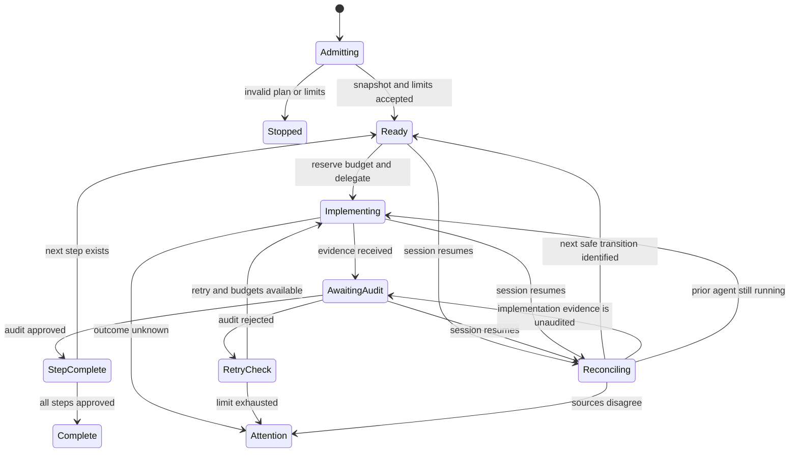

# Paseo Plan Execution Supervisor - Plan

## Goal Capsule

- **Objective:** Provide a resumable OpenCode supervisor that executes an approved plan sequentially by delegating implementation and independent audit through the local Paseo daemon.
- **Product authority:** This Product Contract governs v1 behavior. Each run is additionally bound to its immutable plan snapshot and declared limits.
- **Open blockers:** None at the requirements level. Planning must prove how each supported provider configuration supplies enforceable token and cost accounting before that configuration can run.

---

## Product Contract

### Summary

Build a thin OpenCode command backed by a reusable supervision skill and a setup capability.
The supervisor delegates work rather than implementing it, enforces hard run limits, records authoritative events, and resumes only when recorded and observed state agree.

### Problem Frame

Long-running plan execution can outlive the OpenCode session that started it.
A conversation transcript or worker completion message does not establish which plan step was authorized, independently verified, retried, or safe to resume.
Unbounded retries and uncertain provider usage can also consume more tokens or money than the operator intended.

OpenCode custom commands are prompt templates rather than durable workflow state.
Paseo persists agent lifecycle information and exposes agent logs, but it does not assign supervisor-approved meaning to plan-step completion.
The product therefore needs a repo-owned execution authority that survives session loss without treating worker or Paseo lifecycle state as approval.

### Key Decisions

- **Use a command plus reusable skill.** (session-settled: user-approved — chosen over a command-only implementation: a prompt template cannot own durable execution state.) Governs R1-R2.
- **Ship setup with supervision.** (session-settled: user-directed — chosen over a separate follow-on setup plan: every run must validate its safety configuration before dispatch.) Governs R3-R5.
- **Execute sequentially in v1.** (session-settled: user-directed — chosen over parallel execution: concurrency is not needed for the first trustworthy workflow.) Governs R8.
- **Bind each run to an immutable plan snapshot.** (session-settled: user-approved — chosen over a live plan file: later edits must not silently change authorized work.) Governs R6-R7.
- **Make the supervisor the sole state authority.** (session-settled: user-approved — chosen over worker or shared status updates: concurrent and self-reported transitions are unsafe.) Governs R9-R11.
- **Use an append-only journal with derived status.** (session-settled: user-approved — chosen over a mutable checkpoint or Paseo-led state: recovery needs complete transition provenance.) Governs R10-R12.
- **Require independent audit for completion.** (session-settled: user-approved — chosen over worker success or tests alone: agent termination does not prove the plan step is correct.) Governs R13-R15.
- **Enforce bounded retries and hard budgets.** (session-settled: user-directed — chosen over advisory or unbounded limits: uncontrolled retries, tokens, and cost are primary failure modes.) Governs R16-R21.
- **Fail closed on uncertainty or resume conflict.** (session-settled: user-approved — chosen over best-effort continuation or automatic reconciliation: the supervisor must not guess when authority or budget is unclear.) Governs R7, R19-R20, R23-R26.
- **Keep active observability attention-first.** (session-settled: user-approved — chosen over a live dashboard: routine detail belongs in the journal while OpenCode surfaces budgets and intervention needs.) Governs R27-R28.

### Actors

- A1. **Operator:** Starts, monitors, resumes, or stops a run and resolves escalations.
- A2. **Setup capability:** Establishes and validates repository supervision defaults.
- A3. **Supervisor:** Owns run admission, delegation, authoritative state transitions, limits, and operator communication.
- A4. **Implementation agent:** Performs one authorized plan step and returns changes plus evidence.
- A5. **Audit agent:** Independently evaluates a step against the plan snapshot and returns a verdict plus evidence.
- A6. **Paseo daemon:** Runs delegated agents and exposes their lifecycle and logs.

### Requirements

**Entry Point and Configuration**

- R1. An OpenCode command must provide a discoverable entry point for starting and resuming supervised plan execution.
- R2. The command must invoke a reusable supervision capability rather than contain the complete workflow itself.
- R3. The setup capability must establish repository defaults for retry, token, and cost limits, with explicit run-level overrides allowed.
- R4. Every run must have all three limits before execution begins, whether supplied by repository defaults or run overrides.
- R5. Setup and run admission must reject a configuration that cannot support defensible enforcement of every required limit.

**Plan Authority and Execution Boundary**

- R6. A run must execute against an immutable snapshot of one approved plan.
- R7. A changed, missing, or unverifiable snapshot must stop execution and require operator attention.
- R8. V1 must execute plan steps sequentially and must not dispatch a later step before the current step reaches an authorized terminal state.
- R9. The supervisor must not implement plan work, repair the plan, or issue its own audit verdict.
- R10. The supervisor alone may advance authoritative run and step state.
- R11. Delegated agents must return evidence to the supervisor and must not directly mark steps complete or mutate authoritative state.

**Run Record and Invariants**

- R12. Each run must have a durable append-only journal from which its current status can be derived after loss of the initiating session.
- R13. The journal must preserve the plan snapshot identity, declared limits, delegations, evidence references, audit verdicts, retries, operator decisions, budget changes, and state transitions.
- R14. A step may become completed only after a separate audit agent approves the implementation against the plan snapshot and recorded evidence.
- R15. A worker report, passing test, commit, or successful Paseo agent exit must not independently authorize completion.

**Retries and Budgets**

- R16. Each run must enforce a bounded retry limit defined by its effective configuration.
- R17. An audit rejection may trigger another implementation attempt only while the retry limit and all budgets permit it.
- R18. Retry exhaustion must stop the affected run and request operator attention without marking the rejected step complete.
- R19. Token and cost limits must cover all delegated work in the run, including implementation, audit, and retries.
- R20. Before every delegation, the supervisor must reserve a defensible worst-case token and cost allowance and refuse dispatch when either allowance exceeds the remaining run budget.
- R21. Missing, stale, incomparable, or otherwise unverifiable usage information must stop further dispatch rather than weaken a hard limit.

**Resume and Reconciliation**

- R22. A fresh session must be able to discover unfinished runs and present them for explicit operator selection.
- R23. Resume must reconcile the append-only journal and derived status with the immutable plan snapshot, relevant Paseo agents, and repository or worktree evidence before taking action.
- R24. Any disagreement among those sources must stop resumption and present the conflict for operator resolution.
- R25. Resume must not redispatch work whose prior delegation is running, completed but unaudited, or of unknown outcome.
- R26. When reconciliation succeeds, the supervisor must continue from the next safe transition without repeating an already authorized transition or resetting consumed limits.

**Operator Observability and Completion**

- R27. During execution, OpenCode must keep the operator informed of remaining limits and surface any condition that requires attention.
- R28. Routine delegation detail must remain available in the durable journal without requiring a live dashboard.
- R29. A run may be reported complete only when every in-scope plan step is independently approved and no conflict, exhausted limit, unresolved permission, or unknown delegation remains.
- R30. The final run summary must identify the plan snapshot, completed steps, consumed limits, retries, audit outcomes, interventions, and final disposition.

### Lifecycle Invariants

- The immutable plan snapshot is the only plan authority for an admitted run. Covers R6-R7.
- Only the supervisor commits authoritative transitions. Covers R10-R11.
- Journal history is additive; corrections are new events rather than rewritten history. Covers R12-R13.
- Implementation and audit are performed by different delegated roles. Covers R14-R15.
- No delegation begins without a valid retry allowance and reserved token and cost capacity. Covers R16-R21.
- Session loss does not reset attempts, consumed budgets, evidence, verdicts, or operator decisions. Covers R22-R26.
- Uncertainty stops execution; it never silently lowers a safety rule. Covers R5, R7, R21, R24-R25.

### Key Flows

- F1. **Configure supervision**
  - **Trigger:** A1 invokes setup for a repository.
  - **Actors:** A1, A2, A6
  - **Steps:** Setup gathers or confirms all required defaults, checks local Paseo availability, validates role configuration and enforceable accounting, and reports any blocking deficiency.
  - **Outcome:** The repository has valid supervision defaults or a specific fail-closed result.
  - **Covers:** R3-R5.
- F2. **Start a run**
  - **Trigger:** A1 supplies an approved plan to the command.
  - **Actors:** A1, A3
  - **Steps:** The supervisor validates readiness, applies defaults and overrides, snapshots the plan, initializes the journal, and admits or rejects the run.
  - **Outcome:** A traceable run is ready for its first step or no work is dispatched.
  - **Covers:** R1-R8, R12-R13.
- F3. **Execute and audit a step**
  - **Trigger:** A run has a ready step.
  - **Actors:** A3, A4, A5, A6
  - **Steps:** The supervisor reserves budgets, delegates implementation, records evidence, delegates independent audit, and commits the resulting authorized transition.
  - **Outcome:** The step completes, enters a bounded retry, or stops for attention.
  - **Covers:** R9-R21.
- F4. **Resume an unfinished run**
  - **Trigger:** A1 requests resume from a new or continuing session.
  - **Actors:** A1, A3, A6
  - **Steps:** The supervisor presents unfinished runs, reconciles the selected run, reports its state and remaining limits, and either continues from the next safe transition or stops on conflict.
  - **Outcome:** No prior work or consumption is duplicated, forgotten, or silently reclassified.
  - **Covers:** R22-R28.
- F5. **Close a run**
  - **Trigger:** Every step is approved or execution reaches a terminal stop.
  - **Actors:** A1, A3
  - **Steps:** The supervisor verifies terminal conditions, records the final disposition, and presents the final summary.
  - **Outcome:** The operator receives a complete result or an explicit incomplete disposition with required attention.
  - **Covers:** R18, R24, R29-R30.

### Acceptance Examples

- AE1. **Valid configured launch**
  - **Covers R3-R6, R12-R13.**
  - **Given:** The repository defines valid retry, token, and cost defaults and the supplied plan is executable.
  - **When:** The operator starts a run without overrides.
  - **Then:** The supervisor snapshots the plan, records the effective limits, and admits the first step.
- AE2. **Incomplete plan rejected**
  - **Covers R5-R7, R9.**
  - **Given:** The supplied plan lacks information required for safe execution.
  - **When:** The operator attempts to start a run.
  - **Then:** No agent is dispatched and the operator is directed back to planning with the blocking gaps.
- AE3. **Budget reservation prevents overspend**
  - **Covers R19-R21.**
  - **Given:** The next delegation's worst-case allowance exceeds the remaining token or cost budget.
  - **When:** The supervisor evaluates dispatch.
  - **Then:** Dispatch is refused and the run requests operator attention without exceeding the declared limit.
- AE4. **Audit rejection uses a bounded retry**
  - **Covers R14-R18.**
  - **Given:** An implementation is rejected and one retry remains with sufficient budgets.
  - **When:** The supervisor records the verdict.
  - **Then:** One corrective implementation attempt may be delegated, and the step remains incomplete pending a new independent audit.
- AE5. **Retry exhaustion stops safely**
  - **Covers R16-R18, R29.**
  - **Given:** An implementation is rejected after its final permitted attempt.
  - **When:** The supervisor evaluates the verdict.
  - **Then:** The run stops for attention and cannot be reported complete.
- AE6. **Session loss during implementation**
  - **Covers R22-R26.**
  - **Given:** The initiating OpenCode session ends while a Paseo implementation agent is still running.
  - **When:** A fresh session resumes the run.
  - **Then:** The supervisor recognizes the existing delegation and does not launch a duplicate.
- AE7. **Completed implementation remains unaudited**
  - **Covers R14-R15, R23-R26.**
  - **Given:** Reconciliation finds implementation evidence but no approved audit verdict.
  - **When:** The run resumes.
  - **Then:** The step remains incomplete and proceeds to independent audit if all limits and evidence are valid.
- AE8. **Resume conflict fails closed**
  - **Covers R23-R26.**
  - **Given:** The journal, Paseo state, or repository evidence disagree about a prior delegation.
  - **When:** The operator attempts to resume.
  - **Then:** The supervisor presents the conflict and performs no further delegation until the operator resolves it.
- AE9. **Successful completion**
  - **Covers R29-R30.**
  - **Given:** Every plan step has an independent approval and no unresolved stop condition remains.
  - **When:** The supervisor closes the run.
  - **Then:** The final summary reports the approved result and the full consumption and intervention history remains auditable.

### Success Criteria

- A run interrupted at any lifecycle state can be classified safely from a fresh OpenCode session without relying on conversation history.
- No step is marked complete without an independent approval tied to the immutable plan snapshot and recorded evidence.
- No delegation begins when its worst-case reservation could exceed the remaining token or cost budget.
- Every retry, budget decision, state transition, and operator intervention can be traced in order without overwritten history.
- The operator is interrupted only for conditions requiring attention and can inspect the journal for routine detail.

### Scope Boundaries

**In scope for v1**

- Local Paseo daemon operation from OpenCode.
- Sequential execution of an existing implementation-ready plan.
- Repository defaults with explicit per-run overrides.
- Delegated implementation and cross-role independent audit.
- Hard retry, token, and cost limits.
- Durable audit journal, derived status, explicit resume selection, and conflict-stop reconciliation.
- Setup and validation for the supported v1 workflow.

**Deferred for later**

- Parallel plan-step execution, dependency scheduling, and concurrent worktree coordination.
- Remote Paseo hosts.
- Dynamic model selection or cost-quality optimization beyond configured role preferences.
- A live dashboard or continuously updating visual status surface.

**Outside v1 behavior**

- Creating, decomposing, repairing, or silently amending an incomplete plan.
- Allowing workers or auditors to commit authoritative state.
- Continuing when accounting, plan identity, delegation outcome, or resume state is uncertain.
- Treating tests, commits, worker reports, or Paseo exit status as substitutes for independent approval.
- Retrying indefinitely or raising a declared budget automatically.

### Dependencies and Assumptions

- The local Paseo daemon and configured role providers are available before a run is admitted.
- Supported providers expose enough information or enforceable controls for setup to establish defensible worst-case token and cost reservations.
- Existing repository role preferences remain the default source for implementation and audit provider selection.
- The supplied plan has already completed planning and is executable without product or technical invention by the supervisor.
- Repository and worktree evidence can be inspected without requiring the supervisor to alter application code directly.

### Outstanding Questions

**Resolve Before Planning**

- None.

**Deferred to Planning**

- Choose the durable journal and derived-status representation while preserving R10-R13 and atomic recovery.
- Define how setup proves token and cost enforceability for each supported provider and how worst-case reservations are calculated.
- Define the repository configuration surface and precedence rules for defaults and explicit run overrides.
- Define how unfinished runs are discovered and selected without silently choosing one.
- Define the evidence contract exchanged among implementation agents, audit agents, and the supervisor.

### Sources and Research

- `dotfiles/opencode/agents-archive/orchestrator.md` provides the nearest prior supervision, shared-log, and per-task audit pattern.
- `dotfiles/opencode/agents-archive/auditor.md` provides the nearest prior independent-verdict role.
- `dotfiles/opencode/agents-archive/builder.md` contains an earlier tracking-file resumption convention.
- `dotfiles/paseo/orchestration-preferences.json` defines current role-based provider preferences and cross-family audit intent.
- `dotfiles/opencode/commands/wrapup.md` demonstrates the existing thin-command-to-skill convention.
- [Paseo CLI documentation](https://paseo.sh/docs/cli) documents local agent lifecycle, logs, waiting, and machine-readable output.
