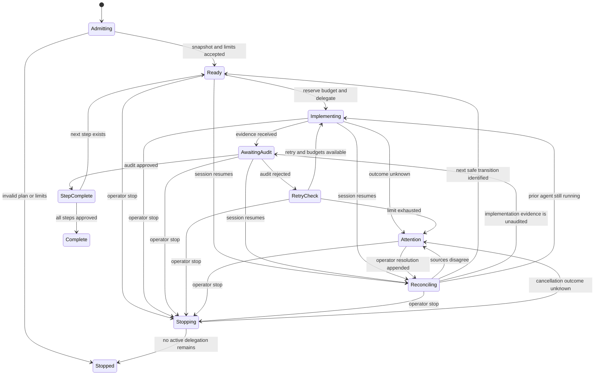
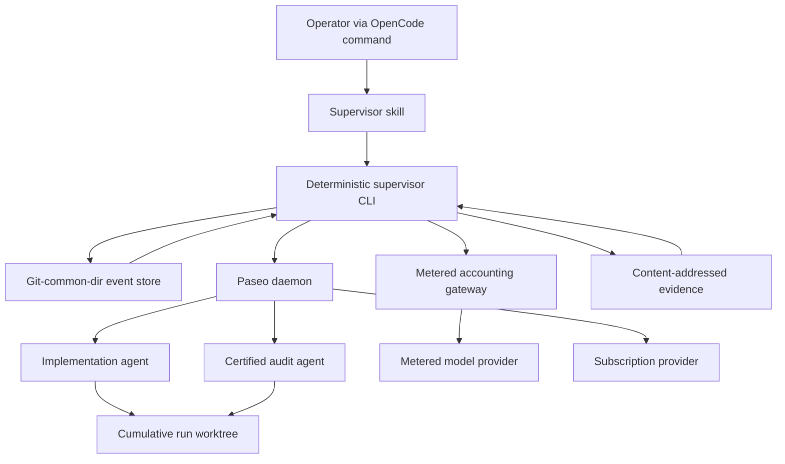

# Paseo Plan Execution Supervisor - Plan

## Goal Capsule

- **Objective:** Provide a resumable OpenCode supervisor that executes an approved plan sequentially by delegating implementation and calibrated independent audit through the local Paseo daemon.
- **Product authority:** This Product Contract governs v1 behavior. Each run is additionally bound to its immutable plan snapshot and declared limits.
- **Execution profile:** Subscription-backed Codex and OpenCode Go roles use provider-enforced subscription limits plus bounded retries. Metered roles require enforceable run token and cost limits.
- **Open blocker:** Select at least one worker-isolation profile and an operator-authorization trust anchor that current Paseo/provider execution can enforce; until then setup may support zero runnable profiles.
- **Stop conditions:** Invalid plan authority, unavailable required accounting, uncertified audit, exhausted retries or budgets, unresolved permissions, and reconciliation conflicts stop dispatch.
- **Tail ownership:** The supervisor owns final reconciliation and reporting; implementation and audit agents never authorize completion.

---

## Product Contract

### Summary

Build a thin OpenCode command backed by a reusable supervision skill, deterministic supervisor tooling, and a setup capability.
The supervisor delegates work rather than implementing it, applies provider-class limits, records authoritative events, requires calibrated audit, and resumes only when recorded and observed state agree.

### Problem Frame

Long-running plan execution can outlive the OpenCode session that started it.
A conversation transcript or worker completion message does not establish which plan step was authorized, independently verified, retried, or safe to resume.
Unbounded retries and uncertain provider usage can also consume more tokens or money than the operator intended.

OpenCode custom commands are prompt templates rather than durable workflow state.
Paseo persists agent lifecycle information and exposes agent logs, but it does not assign supervisor-approved meaning to plan-step completion.
The product therefore needs a repo-owned execution authority that survives session loss without treating worker or Paseo lifecycle state as approval.

### Key Decisions

- **Use a command plus reusable skill.** (session-settled: user-approved — chosen over a command-only implementation: a prompt template cannot own durable execution state.) Governs R1-R2.
- **Ship setup with supervision.** (session-settled: user-directed — chosen over a separate follow-on setup plan: every run must validate its safety configuration before dispatch.) Governs R3-R5.
- **Execute sequentially in v1.** (session-settled: user-directed — chosen over parallel execution: concurrency is not needed for the first trustworthy workflow.) Governs R8.
- **Bind each run to an immutable plan snapshot.** (session-settled: user-approved — chosen over a live plan file: later edits must not silently change authorized work.) Governs R6-R7.
- **Make the supervisor the sole state authority.** (session-settled: user-approved — chosen over worker or shared status updates: concurrent and self-reported transitions are unsafe.) Governs R9-R11.
- **Use an append-only journal with derived status.** (session-settled: user-approved — chosen over a mutable checkpoint or Paseo-led state: recovery needs complete transition provenance.) Governs R10-R12.
- **Require independent audit for completion.** (session-settled: user-approved — chosen over worker success or tests alone: agent termination does not prove the plan step is correct.) Governs R13-R15.
- **Use provider-class limits.** (session-settled: user-directed — chosen over universal per-run token and cost enforcement: subscription-backed Codex and OpenCode Go already have provider-enforced account limits, while metered providers need run-level controls.) Governs R3-R5, R16-R21.
- **Calibrate audit before it can authorize completion.** (session-settled: user-approved — chosen over treating cross-family model contrast as sufficient: judge miscalibration can produce false completion.) Governs R14-R15, R31-R33.
- **Fail closed on uncertainty or resume conflict.** (session-settled: user-approved — chosen over best-effort continuation or automatic reconciliation: the supervisor must not guess when authority or budget is unclear.) Governs R7, R19-R20, R23-R26.
- **Keep active observability attention-first.** (session-settled: user-approved — chosen over a live dashboard: routine detail belongs in the journal while OpenCode surfaces budgets and intervention needs.) Governs R27-R28.

### Actors

- A1. **Operator:** Starts, monitors, resumes, or stops a run and resolves escalations.
- A2. **Setup capability:** Establishes and validates repository supervision defaults.
- A3. **Supervisor:** Owns run admission, delegation, authoritative state transitions, limits, and operator communication.
- A4. **Implementation agent:** Performs one authorized plan step and returns changes plus evidence.
- A5. **Audit agent:** Independently evaluates a step against the plan snapshot and returns a verdict plus evidence.
- A6. **Paseo daemon:** Runs delegated agents and exposes their lifecycle and logs.

### Requirements

**Entry Point and Configuration**

- R1. An OpenCode command must provide a discoverable entry point for starting and resuming supervised plan execution.
- R2. The command must invoke a reusable supervision capability rather than contain the complete workflow itself.
- R3. The setup capability must classify every implementation and audit role as `subscription` or `metered`, establish a retry limit for every run, and establish token and cost limits for metered runs, with explicit run-level overrides allowed.
- R4. A subscription run may rely on provider-enforced account limits without per-run token or cost limits; a metered run must have retry, token, and cost limits before execution begins.
- R5. Setup and run admission must reject unknown provider classes and any metered configuration that cannot enforce and reconcile its declared token and cost limits.

**Plan Authority and Execution Boundary**

- R6. A run must execute against an immutable snapshot of one approved plan.
- R7. A changed, missing, or unverifiable snapshot must stop execution and require operator attention.
- R8. V1 must execute plan steps sequentially and must not dispatch a later step before the current step reaches an authorized terminal state.
- R9. The supervisor must not implement plan work, repair the plan, or issue its own audit verdict.
- R10. The supervisor alone may advance authoritative run and step state.
- R11. Delegated agents must return evidence to the supervisor and must not directly mark steps complete or mutate authoritative state.

**Run Record and Invariants**

- R12. Each run must have a durable append-only journal from which its current status can be derived after loss of the initiating session.
- R13. The journal must preserve the plan snapshot identity, declared limits, delegations, evidence references, audit verdicts, retries, operator decisions, budget changes, and state transitions.
- R14. A step may become completed only after a separate agent using a certified audit profile approves the implementation against the plan snapshot and recorded evidence.
- R15. A worker report, passing test, commit, or successful Paseo agent exit must not independently authorize completion.

**Retries and Budgets**

- R16. Each run must enforce a bounded retry limit defined by its effective configuration.
- R17. An audit rejection may trigger another implementation attempt only while the retry limit and all budgets permit it.
- R18. Retry exhaustion must stop the affected run and request operator attention without marking the rejected step complete.
- R19. For metered runs, token and cost limits must cover all delegated work, including implementation, audit, and retries; subscription runs must retain bounded retries and surface available usage as advisory observability.
- R20. Before every metered delegation, the supervisor must reserve a defensible worst-case token and cost allowance and refuse dispatch when either allowance exceeds the remaining run budget.
- R21. Missing, stale, incomparable, or otherwise unverifiable usage information must stop further metered dispatch; subscription runs stop on provider exhaustion or rate-limit errors without treating absent usage telemetry as a budget violation.

**Resume and Reconciliation**

- R22. A fresh session must be able to discover unfinished runs and present them for explicit operator selection.
- R23. Resume must reconcile the append-only journal and derived status with the immutable plan snapshot, relevant Paseo agents, and repository or worktree evidence before taking action.
- R24. Any disagreement among those sources must stop resumption and present the conflict for operator resolution.
- R25. Resume must not redispatch work whose prior delegation is running, completed but unaudited, or of unknown outcome.
- R26. When reconciliation succeeds, the supervisor must continue from the next safe transition without repeating an already authorized transition or resetting consumed limits.

**Operator Observability and Completion**

- R27. During execution, OpenCode must keep the operator informed of remaining limits and surface any condition that requires attention.
- R28. Routine delegation detail must remain available in the durable journal without requiring a live dashboard.
- R29. A run may be reported complete only when every in-scope plan step is independently approved and no conflict, exhausted limit, unresolved permission, or unknown delegation remains.
- R30. The final run summary must identify the plan snapshot, completed steps, consumed limits, retries, audit outcomes, interventions, and final disposition.

**Audit Calibration**

- R31. Setup must certify each audit profile against a versioned human-reviewed calibration corpus before that profile can authorize completion.
- R32. Certification must tolerate no false approval of a human-labeled completion blocker and must fail when required deterministic evidence is missing, stale, or mismatched.
- R33. A confirmed production false approval or a material change to the audit rubric, prompt, evidence schema, provider, model, or settings must decertify the profile until recalibration succeeds.

**Operator Stop**

- R34. An operator stop request must prevent new delegation, attempt to cancel active agents, reconcile unknown cancellation outcomes, reject late results, and close with an explicit incomplete disposition rather than completion.

### Lifecycle Invariants

- The immutable plan snapshot is the only plan authority for an admitted run. Covers R6-R7.
- Only the supervisor commits authoritative transitions. Covers R10-R11.
- Journal history is additive; corrections are new events rather than rewritten history. Covers R12-R13.
- Implementation and audit are performed by different delegated roles. Covers R14-R15.
- No delegation begins without a valid retry allowance and the limits required by its provider class. Covers R3-R5, R16-R21.
- Only a certified and currently matching audit profile may authorize completion. Covers R14-R15, R31-R33.
- Session loss does not reset attempts, consumed budgets, evidence, verdicts, or operator decisions. Covers R22-R26.
- Uncertainty stops execution; it never silently lowers a safety rule. Covers R5, R7, R21, R24-R25.

### Key Flows

- F1. **Configure supervision**
  - **Trigger:** A1 invokes setup for a repository.
  - **Actors:** A1, A2, A6
  - **Steps:** Setup gathers or confirms provider classes and required defaults, checks local Paseo availability, validates metered accounting and audit certification, and reports any blocking deficiency.
  - **Outcome:** The repository has valid supervision defaults or a specific fail-closed result.
  - **Covers:** R3-R5, R31-R33.
- F2. **Start a run**
  - **Trigger:** A1 supplies an approved plan to the command.
  - **Actors:** A1, A3
  - **Steps:** The supervisor validates readiness, applies defaults and overrides, snapshots the plan, initializes the journal, and admits or rejects the run.
  - **Outcome:** A traceable run is ready for its first step or no work is dispatched.
  - **Covers:** R1-R8, R12-R13.
- F3. **Execute and audit a step**
  - **Trigger:** A run has a ready step.
  - **Actors:** A3, A4, A5, A6
  - **Steps:** The supervisor reserves budgets, delegates implementation, records evidence, delegates independent audit, and commits the resulting authorized transition.
  - **Outcome:** The step completes, enters a bounded retry, or stops for attention.
  - **Covers:** R9-R21.
- F4. **Resume an unfinished run**
  - **Trigger:** A1 requests resume from a new or continuing session.
  - **Actors:** A1, A3, A6
  - **Steps:** The supervisor presents unfinished runs, reconciles the selected run, reports its state and remaining limits, and either continues from the next safe transition or stops on conflict.
  - **Outcome:** No prior work or consumption is duplicated, forgotten, or silently reclassified.
  - **Covers:** R22-R28.
- F5. **Close a run**
  - **Trigger:** Every step is approved or execution reaches a terminal stop.
  - **Actors:** A1, A3
  - **Steps:** The supervisor verifies terminal conditions, records the final disposition, and presents the final summary.
  - **Outcome:** The operator receives a complete result or an explicit incomplete disposition with required attention.
  - **Covers:** R18, R24, R29-R30.

### Acceptance Examples

- AE1. **Valid metered launch**
  - **Covers R3-R6, R12-R13.**
  - **Given:** The repository defines a valid metered profile with retry, token, and cost defaults and the supplied plan is executable.
  - **When:** The operator starts a run without overrides.
  - **Then:** The supervisor snapshots the plan, records the effective limits, and admits the first step.
- AE2. **Incomplete plan rejected**
  - **Covers R5-R7, R9.**
  - **Given:** The supplied plan lacks information required for safe execution.
  - **When:** The operator attempts to start a run.
  - **Then:** No agent is dispatched and the operator is directed back to planning with the blocking gaps.
- AE3. **Budget reservation prevents overspend**
  - **Covers R19-R21.**
  - **Given:** The next delegation's worst-case allowance exceeds the remaining token or cost budget.
  - **When:** The supervisor evaluates dispatch.
  - **Then:** Dispatch is refused and the run requests operator attention without exceeding the declared limit.
- AE4. **Audit rejection uses a bounded retry**
  - **Covers R14-R18.**
  - **Given:** An implementation is rejected and one retry remains with sufficient budgets.
  - **When:** The supervisor records the verdict.
  - **Then:** One corrective implementation attempt may be delegated, and the step remains incomplete pending a new independent audit.
- AE5. **Retry exhaustion stops safely**
  - **Covers R16-R18, R29.**
  - **Given:** An implementation is rejected after its final permitted attempt.
  - **When:** The supervisor evaluates the verdict.
  - **Then:** The run stops for attention and cannot be reported complete.
- AE6. **Session loss during implementation**
  - **Covers R22-R26.**
  - **Given:** The initiating OpenCode session ends while a Paseo implementation agent is still running.
  - **When:** A fresh session resumes the run.
  - **Then:** The supervisor recognizes the existing delegation and does not launch a duplicate.
- AE7. **Completed implementation remains unaudited**
  - **Covers R14-R15, R23-R26.**
  - **Given:** Reconciliation finds implementation evidence but no approved audit verdict.
  - **When:** The run resumes.
  - **Then:** The step remains incomplete and proceeds to independent audit if all limits and evidence are valid.
- AE8. **Resume conflict fails closed**
  - **Covers R23-R26.**
  - **Given:** The journal, Paseo state, or repository evidence disagree about a prior delegation.
  - **When:** The operator attempts to resume.
  - **Then:** The supervisor presents the conflict and performs no further delegation until the operator resolves it.
- AE9. **Successful completion**
  - **Covers R29-R30.**
  - **Given:** Every plan step has an independent approval and no unresolved stop condition remains.
  - **When:** The supervisor closes the run.
  - **Then:** The final summary reports the approved result and the full consumption and intervention history remains auditable.
- AE10. **Subscription launch without run budgets**
  - **Covers R3-R5, R16, R19-R21.**
  - **Given:** Implementation and audit roles use declared subscription-backed Codex or OpenCode Go profiles with a bounded retry limit.
  - **When:** The operator starts a run without token or cost limits.
  - **Then:** The supervisor admits the run, reports usage telemetry as advisory when available, and stops safely if the provider reports subscription exhaustion or a rate limit.
- AE11. **Unverifiable metered usage fails closed**
  - **Covers R5, R19-R21.**
  - **Given:** A metered delegation ends without fresh and comparable usage data.
  - **When:** The supervisor attempts to settle its reservation.
  - **Then:** The full reservation remains consumed, no further delegation begins, and the run requests operator attention.
- AE12. **Audit profile loses certification**
  - **Covers R14-R15, R31-R33.**
  - **Given:** A production approval is confirmed to have missed a completion blocker.
  - **When:** The calibration record is updated.
  - **Then:** The audit profile is decertified for future approvals, active affected runs require reconciliation, and prior journal history is not rewritten.
- AE13. **Operator stop survives interruption**
  - **Covers R22-R26, R29-R30, R34.**
  - **Given:** A run has an active implementation or audit delegation when the operator requests stop.
  - **When:** The initiating session ends during cancellation and a fresh session resumes.
  - **Then:** No new work is dispatched, late results cannot authorize completion, unknown cancellation state requires attention, and the final summary records an incomplete stopped disposition.
- AE14. **Conflict resolution re-reconciles**
  - **Covers R23-R26.**
  - **Given:** Resume detects a conflict that policy allows an operator to resolve.
  - **When:** An authorized resolution is appended against the current journal head.
  - **Then:** The supervisor refreshes every observation and reconciles again before any transition or dispatch.

### Success Criteria

- A run interrupted at any lifecycle state can be classified safely from a fresh OpenCode session without relying on conversation history.
- No step is marked complete without an independent approval tied to the immutable plan snapshot and recorded evidence.
- No metered delegation begins when its worst-case reservation could exceed the remaining token or cost budget.
- Subscription-backed Codex and OpenCode Go runs can execute without per-run token or cost limits while retaining bounded retries and explicit provider-exhaustion handling.
- No audit profile can authorize completion unless its exact version passes the calibration bar, and a confirmed false approval decertifies it.
- Every retry, budget decision, state transition, and operator intervention can be traced in order without overwritten history.
- The operator is interrupted only for conditions requiring attention and can inspect the journal for routine detail.

### Scope Boundaries

**In scope for v1**

- Local Paseo daemon operation from OpenCode.
- Sequential execution of an existing implementation-ready plan.
- Repository defaults with explicit per-run overrides.
- Delegated implementation and cross-role independent audit.
- Bounded retries for every run, provider-enforced subscription limits for declared subscription profiles, and hard token and cost limits for metered profiles.
- Versioned audit calibration, certification, and production false-approval tracking.
- Durable audit journal, derived status, explicit resume selection, and conflict-stop reconciliation.
- Setup and validation for the supported v1 workflow.

**Deferred for later**

- Parallel plan-step execution, dependency scheduling, and concurrent worktree coordination.
- Remote Paseo hosts.
- Dynamic model selection or cost-quality optimization beyond configured role preferences.
- A live dashboard or continuously updating visual status surface.

**Outside v1 behavior**

- Creating, decomposing, repairing, or silently amending an incomplete plan.
- Allowing workers or auditors to commit authoritative state.
- Continuing when accounting, plan identity, delegation outcome, or resume state is uncertain.
- Treating cross-family model contrast as proof that an audit profile is calibrated.
- Treating tests, commits, worker reports, or Paseo exit status as substitutes for independent approval.
- Retrying indefinitely or raising a declared budget automatically.

### Dependencies and Assumptions

- The local Paseo daemon and configured role providers are available before a run is admitted.
- Subscription-backed Codex and OpenCode Go accounts enforce their own service limits; these limits are not represented as per-run token or dollar budgets.
- A metered provider is usable only through an accounting adapter that can enforce reservations and recover comparable usage after interruption.
- Existing repository role preferences remain the default source for implementation and audit provider selection.
- The supplied plan has already completed planning and is executable without product or technical invention by the supervisor.
- Repository and worktree evidence can be inspected without requiring the supervisor to alter application code directly.

### Outstanding Questions

**Resolve Before Planning**

- Choose the v1 worker trust boundary: require a proven container, OS sandbox, or provider sandbox that denies control-state and credential access, or explicitly narrow the threat model and revise KTD11's guarantees.
- Choose the operator-presence trust anchor for conflict resolution and budget increases so the deterministic CLI can distinguish an operator from a delegated or unrelated local process.
- Enumerate the exact initial host, Paseo version, implementation profile, audit profile, and metered adapter combinations that must pass U8; all other combinations remain unsupported.

**Deferred to Implementation**

- Confirm the exact installed Paseo and provider CLI versions during setup and reject versions outside the tested capability profiles.
- Tune calibration-corpus cases without lowering the certification bar in R32.

### Sources and Research

- `dotfiles/opencode/agents-archive/orchestrator.md` provides the nearest prior supervision, shared-log, and per-task audit pattern.
- `dotfiles/opencode/agents-archive/auditor.md` provides the nearest prior independent-verdict role.
- `dotfiles/opencode/agents-archive/builder.md` contains an earlier tracking-file resumption convention.
- `dotfiles/paseo/orchestration-preferences.json` defines current role-based provider preferences and cross-family audit intent.
- `dotfiles/opencode/commands/wrapup.md` demonstrates the existing thin-command-to-skill convention.
- [Paseo CLI documentation](https://paseo.sh/docs/cli) documents local agent lifecycle, logs, waiting, and machine-readable output.
- [OpenCode provider documentation](https://opencode.ai/docs/providers/) documents provider base-URL overrides and subscription/API provider configuration.
- [OpenCode Zen documentation](https://opencode.ai/docs/zen/) documents pay-as-you-go pricing, workspace limits, and supported API endpoints.

---

## Planning Contract

**Product Contract preservation:** changed R3-R5 and R19-R21 to implement the user-directed subscription-versus-metered accounting policy; strengthened R14 and added R31-R33 for the confirmed audit-calibration gate; added R34 to make A1's existing stop behavior explicit; all other Product Contract behavior and stable IDs are preserved.

### Key Technical Decisions

- KTD1. **Keep authoritative mechanics deterministic.** The OpenCode command and skill orchestrate intent, prompts, and operator interaction, while a Python standard-library CLI owns state transitions, hashing, locking, budget arithmetic, schema validation, and reconciliation. This prevents model judgment from becoming the state authority prohibited by R9-R11.
- KTD2. **Store control state in the Git common directory.** Each repository stores supervisor state under its resolved Git common directory, shared by worktrees but outside delegated worktree content. A run contains an immutable manifest and plan snapshot, atomically published hash-chained event files, content-addressed evidence, and a disposable derived projection. This implements R6-R13 without requiring a database or allowing a mutable checkpoint to become authoritative.
- KTD3. **Use explicit provider capability profiles.** (session-settled: user-directed — chosen over universal hard run budgets: subscription-backed Codex and OpenCode Go already have provider-enforced service limits, while usage-priced providers need run-level protection.) Profiles are explicit configuration, never inferred from model names. `subscription` profiles require retry limits and provider-exhaustion handling; `metered` profiles additionally require an enforcing adapter, immutable rate card, reservation limits, and durable usage settlement. Governs R3-R5 and R16-R21.
- KTD4. **Proxy metered OpenCode traffic through a local accounting gateway.** OpenCode supports provider base-URL overrides, so OpenAI-compatible OpenRouter, OpenCode Zen, and direct DeepSeek API traffic can pass through a repository-independent local gateway that checks the active delegation reservation before forwarding, records provider usage, and refuses requests that cannot fit the remaining allowance. Non-compatible endpoints remain unsupported until an adapter proves equivalent controls. Governs R5 and R19-R21.
- KTD5. **Charge unresolved reservations conservatively.** A metered reservation is journaled before agent creation and remains fully consumed after cancellation, crash, daemon loss, or unverifiable telemetry. Only successful settlement against durable gateway records releases unused capacity. Governs R20-R21 and R23-R26.
- KTD6. **Use a versioned evidence envelope.** Implementation and audit results bind the run, step, attempt, delegation, plan snapshot, workspace tree, changed files, verification commands, raw-output hashes, and criterion-level evidence. Missing or mismatched fields produce `NOT_VERIFIABLE`; Paseo idle state, worker prose, tests, or commits never substitute for this envelope. Governs R11 and R14-R15.
- KTD7. **Certify immutable audit profiles.** (session-settled: user-approved — chosen over cross-family contrast alone: independent models can share the same blind spots.) An audit profile pins rubric, prompt, provider, model, settings, evidence schema, and a human-reviewed 15-case corpus. Certification requires zero false approvals on blocker cases, at least 14/15 overall agreement, zero approvals with invalid evidence, and no more than two false blocks. A confirmed false approval decertifies the profile immediately. Governs R14-R15 and R31-R33.
- KTD8. **Reconcile observations without promoting them to authority.** Resume derives status from the event chain, then compares the plan hash, Git tree, Paseo labels and lifecycle, native persistence handles, permissions, evidence, and provider accounting. Any disagreement transitions to attention and requires an append-only operator resolution event. Governs R22-R26.
- KTD9. **Use explicit run selection and a single writer.** Discovery lists unfinished runs for operator selection. An atomic lock grants one session transition authority; stale locks trigger reconciliation rather than automatic takeover. This prevents silent selection and concurrent resume races.
- KTD10. **Treat the unified plan as the approved specification.** (session-settled: user-approved — chosen over migrating the plan into an absent legacy spec: the CE unified artifact already owns the Product Contract and implementation detail.) Update the repository document-control guidance so `requirements-only` is the specification stage and `implementation-ready` is the executable stage of one artifact.
- KTD11. **Admit only isolated worker profiles.** R10-R11 cannot be enforced by worktree convention alone because delegated agents run as local processes. Setup must prove that the selected Paseo/provider sandbox denies workers access to the Git-common-dir control store, upstream credentials, gateway signing keys, operator authorization, and other run worktrees while permitting only the assigned worktree and result channel. Unsupported host/provider combinations fail setup rather than relying on prompt compliance.
- KTD12. **Authenticate every privileged local action.** Loopback binding limits transport exposure but does not establish caller authority. Gateway requests use scoped, expiring, replay-resistant delegation capabilities; conflict resolution and budget increases require separate operator-presence authorization bound to the expected journal head.

### High-Level Technical Design

The CLI exposes setup, start, list, status, resume, stop, inspect, resolve, and change-budget operations. Every operation that mutates run control state validates the event chain, acquires the run lock, refreshes external observations, applies one legal transition, publishes one event atomically, and regenerates the disposable projection.

### State and Storage Contract

- Repository configuration lives at `.paseo-supervisor/config.json`; explicit run overrides take precedence, then repository defaults. Setup may import role suggestions from `dotfiles/paseo/orchestration-preferences.json` in this repository, but the admitted run manifest is authoritative.
- Run control state lives under `<git-common-dir>/paseo-supervisor/runs/<run-id>/`; implementation must resolve this path with Git rather than hard-code `.git` because worktrees use indirection files.
- `manifest.json` records schema versions, repository identity, plan hash, effective limits, provider and audit profiles, rate-card identity, and the run worktree.
- `plan.snapshot.md` is immutable after admission and verified by content hash before every transition.
- `events/` contains monotonically sequenced immutable JSON events with event ID, previous hash, actor, timestamp, idempotency key, and schema version. Publication uses write, flush, and atomic rename.
- Temporary event files are created in the destination directory so publication never crosses filesystems; setup verifies owner-only permissions and rejects symlinks, junctions, reparse points, unexpected hard links, changed ownership, or permissive access controls in authoritative paths.
- `evidence/` stores immutable content-addressed envelopes and raw outputs. `projection.json` is a cache rebuilt solely from accepted events.
- The initial target is one cumulative isolated worktree per run. Parallel steps and multiple writable worktrees remain deferred.

### Provider Accounting Contract

- Subscription profiles currently admit explicit Codex subscription and OpenCode Go configurations. They require bounded retries, record advisory telemetry when available, and stop on provider rate-limit, quota, authentication, or exhaustion errors.
- Metered profiles require a gateway or adapter capability declaration covering cumulative token enforcement, USD calculation, durable usage, model identity, rate-card version, and bypass prevention.
- The local gateway starts with OpenAI-compatible request/response paths used by OpenRouter, OpenCode Zen models on compatible endpoints, and direct DeepSeek API. Unsupported endpoint protocols fail setup rather than bypass the gateway.
- Supported v1 routes are explicit adapter-owned HTTPS endpoints for `/v1/chat/completions` and `/v1/responses`; repository configuration selects an adapter ID rather than supplying an arbitrary upstream URL. Redirects, environment-derived proxies, absolute-form targets, `CONNECT`, wildcard listeners, and non-allowlisted destinations are rejected.
- Before metered dispatch, the CLI reserves the sum of the profile's finite per-request token maxima across its maximum request count and prices that ceiling with the pinned worst-case rate card. The gateway receives a short-lived delegation capability bound to that reservation and durably debits each request maximum before forwarding.
- OpenCode receives only the gateway capability. The gateway loads and injects the upstream credential from an owner-restricted source after authorization and strips inbound authorization, cookies, forwarding headers, and proxy credentials.
- Capabilities bind run, step, attempt, role, provider adapter, model, routes, reservation, expiry, concurrency, and request identity. Reuse with the same request digest is idempotent; reuse with a changed digest is rejected.
- Auto-reload, balance fallback, provider switching, and unaccounted paid tools must be disabled for a metered profile or included in its declared worst-case accounting.
- Paseo `LastUsage` and live notifications are advisory because current Paseo usage is optional and not durably persisted. The event store and gateway ledger remain the accounting authority.

### Audit Calibration Contract

- The calibration corpus contains five valid, five blocker-defective, and five boundary implementations with frozen plan steps, repository state, deterministic evidence, human verdicts, blocker classifications, and rationales.
- Setup runs the exact audit profile against the full corpus and records the result by profile hash. Any rubric, prompt, evidence-schema, provider, model, or settings change creates a new profile requiring certification.
- Production sampling covers the first five approvals from a profile and then at least 10 percent or one approval per run, whichever is greater. Human reviews append `false_pass`, `false_block`, and failure-category records.
- Recalibration is required after a confirmed false approval, a material profile change, 50 approvals, or 90 days, whichever occurs first.
- Cross-family audit remains the configured default and a defense-in-depth measure, not certification evidence by itself.

### Security Contract

- Protected assets are provider credentials, gateway and operator keys, budget reservations, journal and ledger integrity, repository content, evidence, and audit certification records.
- Trust boundaries are operator-to-supervisor, supervisor-to-Paseo, worker sandbox, OpenCode-to-gateway, gateway-to-provider, and each process-to-control-store boundary. Localhost and a shared OS user are not trust boundaries by themselves.
- The v1 threat model includes compromised repository instructions, a malicious delegated agent, unrelated local processes, browser-to-localhost requests, malicious provider responses, DNS or proxy manipulation, replay, and crash races.
- The gateway binds only to numeric loopback addresses, authenticates every request, validates `Host` and origin behavior, disables redirects and environment proxies, and resolves only adapter-owned public destinations while rejecting private, loopback, link-local, reserved, metadata, and ambiguous addresses.
- Authoritative records are authenticated with key material unavailable to workers. Hash chains provide ordering and corruption evidence but are not treated as protection from a same-user process that can rewrite the full chain.
- Structured diagnostics omit request and response bodies, credentials, environment content, and credential-bearing URLs. Logging is bounded, control-character safe, separate from the accounting ledger, and fail-closed when an authoritative debit cannot be persisted.

### Sequencing

1. Prove the isolation, credential-separation, local-authentication, and control-store permission contract on each supported host/provider profile.
2. Establish schemas, event-store invariants, and provider-profile validation before integrating Paseo.
3. Add subscription execution and deterministic reconciliation before metered execution.
4. Add the metered gateway and prove reservation enforcement with fake-provider contract tests before real provider smoke tests.
5. Add evidence validation and audit certification before allowing any step to transition to complete.
6. Expose the complete workflow through the skill and thin command only after deterministic operations are stable.

### Risks and Mitigations

- **Subscription limits are account-wide, not run-specific.** The UI must say so plainly; retry limits and provider exhaustion handling prevent the supervisor from implying a per-run guarantee that does not exist.
- **Gateway enforcement can miss provider-specific token categories.** Each metered adapter pins a token taxonomy and worst-case rate card; unknown categories stop admission or settlement.
- **A request can exceed its estimate.** The gateway reserves the provider/model maximum for each request and rejects requests that cannot fit; adapters without a defensible request maximum are unsupported.
- **Paseo lifecycle and logs are not completion authority.** Structured envelopes, native persistence handles, and Git fingerprints are required before transitions.
- **Model-based calibration is nondeterministic.** Certification uses repeated fixed fixtures, an asymmetric zero-false-pass bar, profile pinning, and ongoing human sampling.
- **Run control files are machine-local.** They survive sessions and worktrees on one host but not repository transfer; export/import and remote Paseo remain deferred.
- **A worker can bypass accounting or rewrite authority if its sandbox exposes shared credentials or control state.** Setup proves isolation and credential separation for each supported profile; failing profiles are inadmissible.
- **A loopback gateway can still become an open proxy or SSRF primitive.** Adapter-owned destinations, scoped capabilities, strict request parsing, DNS validation, redirect refusal, and disabled environment proxies constrain forwarding.
- **Local callers could forge operator decisions.** Privileged mutations require operator-presence authorization bound to the run, operation, facts, nonce, and current journal head.
- **Secrets can leak through evidence or diagnostics.** Structured allowlisted fields, size limits, synthetic canary tests, and owner-only storage replace reliance on a post-hoc text scan.

---

## Implementation Units

### U8. Security feasibility and isolation contract

- **Goal:** Prove that supported Paseo/provider profiles can isolate delegated workers from supervisor authority, credentials, operator controls, other runs, and direct metered-provider access.
- **Requirements:** R5, R9-R11, R20-R21, R24.
- **Files:** `src/skills/open-skills-agent-ops/paseo-plan-supervisor/scripts/security.py`, `src/skills/open-skills-agent-ops/paseo-plan-supervisor/references/security-contract.md`, `src/skills/open-skills-agent-ops/paseo-plan-supervisor/tests/test_security.py`, `src/skills/open-skills-agent-ops/paseo-plan-supervisor/tests/fixtures/security/`.
- **Approach:** Define host/provider isolation profiles, minimized worker environments, isolated OpenCode auth/config homes, owner-only control paths, gateway-only upstream credentials, and separate operator authorization. Treat same-user discretionary access controls as insufficient unless the provider sandbox demonstrably denies the path.
- **Dependencies:** None.
- **Test scenarios:** Worker cannot read or mutate control state, credentials, signing keys, other worktrees, or operator authorization; direct provider calls fail; non-loopback Paseo is rejected; permissive ACL, symlink, junction, reparse-point, hard-link, or owner substitution stops setup; worker cannot resolve conflicts or raise budgets.
- **Verification:** Security feasibility tests pass for each declared supported host/provider profile before any live delegation or gateway test runs.

### U1. Deterministic run-state core

- **Goal:** Implement the model-free state machine, immutable event store, plan snapshotting, locking, projection rebuild, and CLI skeleton.
- **Requirements:** R6-R18, R22-R26, R29-R30, F2-F5, AE4-AE9.
- **Files:** `src/skills/open-skills-agent-ops/paseo-plan-supervisor/scripts/supervisor.py`, `src/skills/open-skills-agent-ops/paseo-plan-supervisor/scripts/supervisor_core.py`, `src/skills/open-skills-agent-ops/paseo-plan-supervisor/references/state-and-event-contract.md`, `src/skills/open-skills-agent-ops/paseo-plan-supervisor/tests/test_state_store.py`.
- **Approach:** Use Python standard-library data types, JSON, hashing, file locking primitives with explicit platform branches, and same-directory atomic file replacement. Keep the CLI adapter thin and make the reducer pure enough to replay fixtures deterministically. Model admission, operator stop, and final closure as idempotent transitions rather than presentation-side behavior.
- **Dependencies:** U8.
- **Test scenarios:** Legal and illegal transitions; forged, uncertified, or duplicate approvals; later-step dispatch attempted from every non-complete current-step state; duplicate idempotency keys; fault injection after every admission write; crash before and after event publication; operator stop from each active state; late result after stop; interrupted final closure; missing, truncated, reordered, or hash-chain-breaking events; deleted projection rebuild; changed plan snapshot; simultaneous lock attempts; stale lock requiring attention; Git worktree common-directory resolution.
- **Verification:** The state-store test module passes repeatedly with identical projections and no network or model dependency.

### U2. Configuration and provider capability profiles

- **Goal:** Implement setup, precedence, validation, and immutable admission records for subscription and metered roles.
- **Requirements:** R3-R5, R16, R19-R21.
- **Files:** `src/skills/open-skills-agent-ops/paseo-plan-supervisor/scripts/supervisor_core.py`, `src/skills/open-skills-agent-ops/paseo-plan-supervisor/references/configuration.md`, `src/skills/open-skills-agent-ops/paseo-plan-supervisor/references/provider-profiles.md`, `src/skills/open-skills-agent-ops/paseo-plan-supervisor/tests/test_provider_profiles.py`, `src/skills/open-skills-agent-ops/paseo-plan-supervisor/tests/fixtures/config/`.
- **Approach:** Require explicit role classification and pin provider CLI, model, authentication class, accounting adapter, and rate-card identities in the admitted manifest. Implement run override over repository default precedence without reading mutable preferences after admission.
- **Dependencies:** U8, U1. Final runnable readiness also depends on U5 certification.
- **Test scenarios:** Codex and OpenCode Go subscription profiles without budgets; subscription profile with retry limit missing; unknown provider class; metered profile missing token or cost limits; metered adapter version mismatch; mixed subscription/metered roles; auto-reload or balance fallback enabled; absent, expired, changed, or decertified audit profile; override precedence; changed configuration after admission.
- **Verification:** Fixture-driven setup and admission tests prove that valid subscription profiles pass, incomplete metered profiles fail closed, and manifests remain immutable.

### U3. Paseo delegation and lifecycle adapter

- **Goal:** Bind authorized implementation and audit attempts to Paseo agents without treating Paseo lifecycle as approval.
- **Requirements:** R8-R11, R14-R18, R22-R28.
- **Files:** `src/skills/open-skills-agent-ops/paseo-plan-supervisor/scripts/paseo_adapter.py`, `src/skills/open-skills-agent-ops/paseo-plan-supervisor/references/delegation-protocol.md`, `src/skills/open-skills-agent-ops/paseo-plan-supervisor/tests/test_paseo_adapter.py`, `src/skills/open-skills-agent-ops/paseo-plan-supervisor/tests/fixtures/paseo/`.
- **Approach:** Wrap documented JSON lifecycle commands, attach run/step/attempt/role/snapshot labels as discovery aids, journal delegation intent before creation, and make the journaled Paseo agent ID, workspace ID, and native session/thread handle the binding authority. Inject the versioned evidence-envelope contract into every role prompt and classify creation or result gaps conservatively.
- **Dependencies:** U8, U1, U2.
- **Test scenarios:** Daemon unavailable; duplicate titles with distinct labels; crash before intent, after intent, after Paseo creation, before binding, after evidence persistence, and before verdict transition for both roles; running agent on resume; idle agent without result envelope; pre-dispatch and in-flight subscription exhaustion, rate limit, authentication failure, and partial output; pending permission; interruption; stale observation; temporary daemon loss; late worker mutation after audit.
- **Verification:** Captured CLI fixtures pass contract tests, followed by a disposable-repository smoke test against the installed local Paseo version.

### U4. Metered accounting gateway

- **Goal:** Enforce metered delegation reservations for supported OpenAI-compatible provider endpoints and persist authoritative usage independently of Paseo.
- **Requirements:** R5, R19-R21, R23-R24, AE3, AE11.
- **Files:** `src/skills/open-skills-agent-ops/paseo-plan-supervisor/scripts/metering_gateway.py`, `src/skills/open-skills-agent-ops/paseo-plan-supervisor/scripts/supervisor_core.py`, `src/skills/open-skills-agent-ops/paseo-plan-supervisor/references/metering-gateway.md`, `src/skills/open-skills-agent-ops/paseo-plan-supervisor/tests/test_metering_gateway.py`, `src/skills/open-skills-agent-ops/paseo-plan-supervisor/tests/fixtures/provider/`.
- **Approach:** Use an authenticated loopback HTTP forwarding service, scoped delegation capabilities, adapter-owned provider destinations, gateway-only upstream credentials, pinned rate cards, durable debit-before-forward accounting, replay handling, strict HTTP limits, and post-response settlement. Loopback is transport scoping, not authentication.
- **Dependencies:** U8, U1, U2.
- **Test scenarios:** Reservation fits and settles; mixed-role accounting; token fit but cost overflow; request maximum or count exceeds allowance; missing usage; malformed or oversized streaming response; timeout after durable debit; cancellation race; model or route mismatch; capability expiry, revocation, replay, concurrent reuse, or changed request digest; browser-originated request; wrong host or method; redirect, environment proxy, absolute URL, DNS rebinding, private or metadata destination; gateway restart; disk-full ledger; inbound credentials stripped; unsupported protocol; secret canaries absent from every artifact and log.
- **Verification:** Fake-provider fault-injection tests prove no request is forwarded without capacity and unresolved requests retain their full reservation; optional live smoke tests use a user-authorized low-cost metered account.

### U5. Evidence validation and audit certification

- **Goal:** Make completion depend on exact evidence and a certified audit profile rather than role separation alone.
- **Requirements:** R11, R14-R15, R29-R33.
- **Files:** `src/skills/open-skills-agent-ops/paseo-plan-supervisor/scripts/audit.py`, `src/skills/open-skills-agent-ops/paseo-plan-supervisor/references/evidence-contract.md`, `src/skills/open-skills-agent-ops/paseo-plan-supervisor/references/audit-rubric.md`, `src/skills/open-skills-agent-ops/paseo-plan-supervisor/tests/test_audit.py`, `src/skills/open-skills-agent-ops/paseo-plan-supervisor/tests/fixtures/audit-calibration/`.
- **Approach:** Validate envelopes before accepting verdicts, fingerprint the audited Git tree and diff, independently rerun required checks where feasible, and certify profile hashes against the human-reviewed corpus and thresholds in KTD7.
- **Dependencies:** U8, U1, U3.
- **Test scenarios:** Worker-only approval; stale test output; missing raw output; omitted criterion; valid tests with missing behavior; tree mutation after approval; same model used for both roles; corpus false approval; excessive false blocks; profile setting change; production false approval and decertification.
- **Verification:** Model-free schema tests pass, then the full calibration corpus meets R32 using the exact configured audit profile before end-to-end completion is enabled.

### U6. Reconciliation and operator controls

- **Goal:** Expose safe discovery, status, resume, stop, inspection, conflict resolution, and authorized budget changes from a fresh session.
- **Requirements:** R1, R22-R30.
- **Files:** `src/skills/open-skills-agent-ops/paseo-plan-supervisor/scripts/supervisor.py`, `src/skills/open-skills-agent-ops/paseo-plan-supervisor/scripts/supervisor_core.py`, `src/skills/open-skills-agent-ops/paseo-plan-supervisor/references/reconciliation.md`, `src/skills/open-skills-agent-ops/paseo-plan-supervisor/tests/test_reconciliation.py`.
- **Approach:** List candidates without auto-selection, refresh all external observations before decisions, compare them to derived state, and require explicit append-only operator events for conflicts or limit changes. Timeouts and unknown states become attention, not failure or completion.
- **Dependencies:** U1-U5.
- **Test scenarios:** Multiple unfinished runs; explicit selection; repeated idempotent resume; completed-but-unaudited work; active prior delegation; unknown outcome; bind discovered delegation; consume unresolved reservation; accept or reject evidence; non-overridable snapshot conflict; authorized, stale-head, and unauthorized resolutions or budget changes; crash after resolution before continuation; pending permission; subscription exhaustion by role and lifecycle phase; interrupted successful and incomplete closure; final summary completeness.
- **Verification:** Table-driven reconciliation tests cover every lifecycle state and conflict source, followed by session-loss acceptance tests in a disposable repository.

### U7. Skill, command, documentation, and end-to-end acceptance

- **Goal:** Present the deterministic workflow through the established thin-command pattern and align repository documentation with the unified-plan convention.
- **Requirements:** R1-R5, R27-R30, AE1-AE14.
- **Files:** `dotfiles/opencode/commands/paseo-supervise.md`, `src/skills/open-skills-agent-ops/paseo-plan-supervisor/SKILL.md`, `docs/AGENTS.md`, `docs/README.md`, `src/skills/open-skills-agent-ops/paseo-plan-supervisor/tests/test_cli.py`, `src/skills/open-skills-agent-ops/paseo-plan-supervisor/tests/test_acceptance.py`.
- **Approach:** Keep the command to skill loading only. The skill resolves setup/start/resume intent, invokes deterministic operations, delegates only authorized prompts, and reports remaining limits and attention states. Document that one CE unified plan advances from specification-stage `requirements-only` to executable `implementation-ready` in place.
- **Dependencies:** U8, U1-U6.
- **Test scenarios:** Every acceptance example; command discovery; setup on a fresh repository; subscription execution; rejected unsupported metered profile; metered execution through the fake gateway; audit rejection and retry; crash and resume at each delegation boundary; successful final closure; no secret material in control artifacts.
- **Verification:** All unit and acceptance tests pass, the installed skill is discoverable, the command delegates to it, and a disposable end-to-end run survives loss of the initiating OpenCode session.

---

## Verification Contract

| Gate | Command or method | Applies to | Done signal |
| --- | --- | --- | --- |
| Python syntax | Resolve an available Python interpreter, then run `-m compileall src/skills/open-skills-agent-ops/paseo-plan-supervisor/scripts` | U1-U8 | All modules compile without errors. |
| Deterministic unit suite | Resolve an available Python interpreter, then run `-m unittest discover -s src/skills/open-skills-agent-ops/paseo-plan-supervisor/tests -p "test_*.py"` | U1-U8 | State, profile, security, adapter, gateway, audit, reconciliation, CLI, and acceptance tests pass. |
| Isolation feasibility | Run the declared host/provider security profile tests before agent creation | U8, U2-U4 | Workers cannot reach control state, upstream credentials, operator authorization, other runs, or direct metered endpoints. |
| Paseo fixture contracts | Run the adapter tests against version-pinned captured `paseo run --json`, `paseo ls -a -g --json`, and `paseo agent inspect --json` fixtures | U3, U6 | Every supported lifecycle shape maps to one explicit supervisor observation. |
| Local daemon smoke | `paseo daemon status` followed by the disposable-repository acceptance path | U3, U6, U7 | The tested installed Paseo version creates, discovers, and resumes labeled agents without duplicate dispatch. |
| Metered fault injection | Run `test_metering_gateway.py` against the bundled fake provider | U4 | No request bypasses reservation checks; crashes and missing usage retain full reservations. |
| Audit calibration | Run the configured audit profile against `tests/fixtures/audit-calibration/` | U5 | Zero blocker false approvals, at least 14/15 agreement, zero invalid-evidence approvals, and at most two false blocks. |
| Lifecycle fault injection | Run admission, delegation, stop, resolution, and closure crash fixtures for implementation and audit roles | U1, U3, U6 | Resume produces one authoritative transition, never duplicates a delegation, and never advances a later step without certified approval. |
| Skill validation | Invoke the installed skill in a fresh agent session against setup, start, resume, and conflict fixtures | U7 | Prose orchestration calls deterministic operations and never fabricates state transitions. |
| Secret scan | Inspect generated manifests, events, evidence, fixtures, and test logs for credential material | U2, U4, U7 | No API key, bearer token, auth file content, or credential-bearing URL is persisted. |
| Documentation consistency | Review `docs/AGENTS.md`, `docs/README.md`, and this plan together | U7 | All three describe the unified-plan lifecycle without requiring a separate approved spec. |

Live metered-provider smoke tests are opt-in because they incur cost. The fake-provider suite is the required deterministic gate; a live smoke uses a low explicit budget and records only redacted evidence.

---

## Definition of Done

- The Product Contract changes are traceable to the confirmed provider-class and audit-calibration decisions, and no launch-blocking question remains.
- Every implementation unit's named tests and verification gate passes on the supported host platforms.
- A subscription-backed Codex or OpenCode Go run can execute sequentially, survive session loss, and close only after certified independent audit.
- A metered OpenAI-compatible run cannot forward requests beyond its reserved token or cost capacity and stops on unverifiable settlement.
- Supported worker profiles prove isolation from supervisor authority and real provider credentials; unsupported host/provider combinations fail setup.
- Event replay deterministically rebuilds status after crashes, projection deletion, and fresh-session resume.
- Paseo lifecycle, test output, commits, and worker claims cannot independently complete a step.
- The audit profile meets the calibration bar and decertifies correctly after a simulated false approval.
- Operator actions are available from a fresh session without fuzzy run selection or hidden state mutation.
- Operator stop, conflict resolution, budget changes, and final closure are authenticated, append-only, idempotent, and recoverable after interruption.
- Repository documentation recognizes the unified plan as both approved specification and implementation plan at different readiness stages.
- Generated control state and evidence contain no secrets or unrelated personal information.
- Dead-end experiments, temporary fixtures, orphaned agents, disposable worktrees, and abandoned implementation code are removed before completion.
