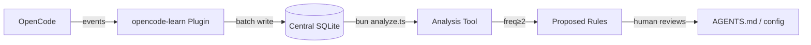

# Install opencode-learn Plugin

Adds passive session observation and correction detection to OpenCode.

## Prerequisites

- OpenCode running on this machine
- The `src/plugins/opencode-learn/` directory exists in this repo

## Install

```powershell
# From repo root
./src/plugins/opencode-learn/install/install.ps1
```

This registers the plugin in `~/.config/opencode/opencode.json` so it loads in every session.

## Verify

```powershell
# After restarting OpenCode and running a few prompts:
sqlite3 "$env:LOCALAPPDATA\..\Local\share\opencode-learn\learn.db" ".tables"
```

Expect 13 tables: `project`, `user_prompt`, `assistant_response`, `session_summary`, `tool_call`, `file_change`, `step`, `shell_command`, `agent_switch`, `model_switch`, `retry`, `permission`, `correction`, `preference`, `proposed_rule`.

## Docs

Full documentation in `src/plugins/opencode-learn/docs/`:

| Type | File | What it covers |
|------|------|----------------|
| Tutorial | `docs/tutorials/getting-started.md` | First run, verify it works |
| How-to | `docs/how-to/install.md` | Manual install/uninstall |
| How-to | `docs/how-to/analyze-data.md` | SQL queries for patterns |
| How-to | `docs/how-to/promote-corrections.md` | Corrections → rules pipeline |
| Reference | `docs/reference/db-schema.md` | All 13 tables + columns |
| Reference | `docs/reference/event-reference.md` | 14 events → tables |
| Explanation | `docs/explanation/architecture.md` | System design and data flow |
| Explanation | `docs/explanation/design-decisions.md` | Why passive, why regex, why central DB |
| Visual | `docs/index.html` | HTML with SVG architecture diagrams |

## How It Works



## Uninstall

1. Remove the plugin path from `~/.config/opencode/opencode.json`
2. Delete the database: `rm ~/.local/share/opencode-learn/learn.db`

